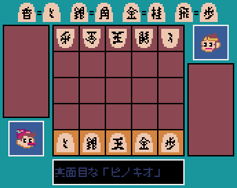

# ミニ将棋

いわゆる「[京都将棋](https://ja.wikipedia.org/wiki/%E4%BA%AC%E9%83%BD%E5%B0%86%E6%A3%8B)」です。

## 操作方法

* 「CPU 対 あなた」を選択すると、コンピュータとの対戦が開始します。
  * SHIFTキーを押しながら開始すると、「高速」となり、先読みをしません。
* 移動したい駒を選択して、移動先をもう一度選択します。
* 持ち駒を選択するたびに、その駒が裏返ります。
* コンピュータの「考え中」に右クリックすると、先読みを停止して、すぐに指します。

## ルール

* 駒は、1手ごと指すごとに裏返ります。
* 持ち駒は、表裏どちらでも打てます。
* 二歩、行き所のない駒、打ち歩詰めなど、何でもありです。

## プログラム

* 日本語フォントは、[8×8ドット日本語フォント「美咲フォント」](https://littlelimit.net/misaki.htm)を使用しました。
* ドット絵アイコンは、[ピクセルガロー](https://hpgpixer.jp/)を使用しました。
